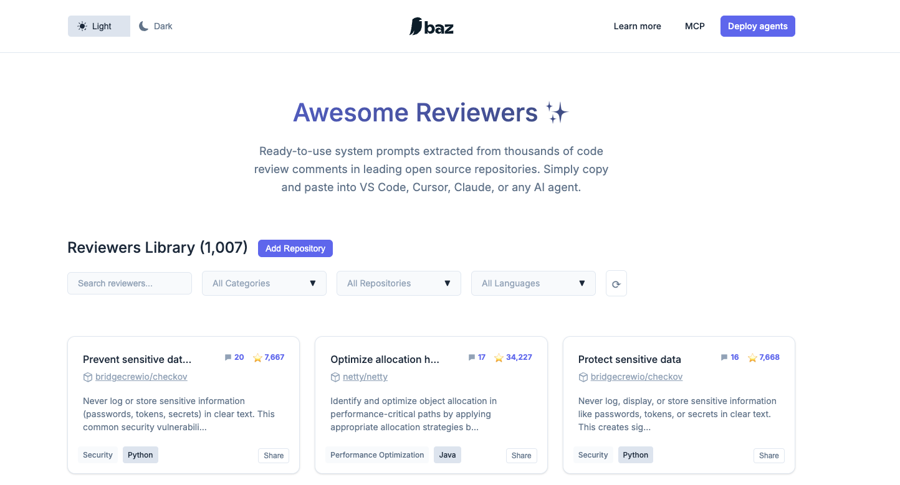

<div align="center">
   
   <h1 align="center"><b>Awesome Reviewers ✨ </b></h1>
   <p align="center">
      Ready-to-use system prompts for Agentic Code Review.
      <br />
      <a href="https://awesomereviewers.com"><strong>AwesomeReviewers.com »</strong></a>
      <br />
   </p>
</div>

<div align="center">
   
</div>


**Awesome Reviewers** is an open-source registry of ready-to-use **system prompts** for agentic code review. Each “reviewer” prompt is distilled from thousands of real code review comments in leading open source repositories. These prompts capture best practices and coding standards that developers can easily apply during pull request reviews. Simply **copy and paste** a prompt into your AI coding agents (e.g. VS Code, Cursor, Claude, or any AI agent) to instantly get code review suggestions aligned with proven standards

<div align="center">

📝 **3K+** Reviewers &nbsp;&nbsp;•&nbsp;&nbsp; ⭐ Popular OSS repositories &nbsp;&nbsp;•&nbsp;&nbsp; 🚀 **100+** Languages

</div>

## Features

* **🎯 3K+ Curated Prompts:** Over 3,000 specialized review prompts across 100+ languages and frameworks, with recent additions for projects like PostHog, DuckDB, ClickHouse, Microsoft Playwright and Microsoft Terminal. Each prompt is distilled from actual pull request comments, ensuring practical, actionable advice grounded in real code review scenarios.

* **📊 Real Open-Source Insights:** Every reviewer includes context from the open-source repository it came from, including a link to the source repo and stats like how many times that feedback appeared and the repo’s popularity. This transparency helps you trust the guidance – it’s based on patterns that occurred in high-quality projects (e.g. a prompt might note **9** prior comments advocating a rule in a project with **16k⭐** on GitHub). In short, these AI prompts encapsulate community-agreed best practices.

* **⚡ Easy Integration:** Using an Awesome Reviewer prompt is as simple as copy-pasting its text into your AI tool of choice. You can prepend the prompt as a **system** or **agent** instruction in chat-based coding assistants (like VS Code’s AI extensions, ChatGPT, Cursor IDE, or Claude) to guide the AI’s code review. The prompts are written to be **IDE-ready** – no extra formatting needed. Just pick a prompt that matches your review focus (for example, “Never commit secrets” for a security review, or “Optimize memory access” for a performance review) and let your AI reviewer follow those guidelines.

* **🔍 Searchable Library:** Browse the entire library at [awesomereviewers.com](https://awesomereviewers.com) with fast search and filtering by category, language, or repository source. Each prompt shows origin repo, stats, and clear descriptions.

* **🚀 One-Click Deployment:** Deploy reviewer agents automatically on your PRs using **[Baz](https://baz.co)**. The site includes a **“🚀 Deploy to baz”** button that lets you spin up the selected reviewer as an AI code review bot in a single click. Baz is a platform for agentic code reviews, and with this integration it can apply the Awesome Reviewers prompts to your PRs without any manual copy-paste. In other words, you get automated code review comments on your GitHub PRs based on the same proven guidelines (with no configuration needed beyond the click). *This is a nod to how Awesome Reviewers works hand-in-hand with Baz to supercharge developer workflows.*

* **🏆 Community Leaderboard:** Check out the new **Leaderboard** page to see the top contributors across all reviewer categories. Contributor stats are automatically regenerated by a GitHub Action on every deployment.

* **🧠 Methodology:** A new Methodology page documents how we extracted repeatable review patterns from real maintainer feedback.

## Getting Started

Using **Awesome Reviewers** is straightforward:

1. **Browse the Library:** Visit [awesomereviewers.com](https://awesomereviewers.com) to view the list of available reviewer prompts. You can search or filter to find a prompt that fits your needs (e.g. *“SQL Injection Check”* under Security, or *“Documentation consistency standards”* under Documentation).

2. **Copy a Prompt:** Click on a reviewer to view the full prompt text and guidelines. Copy the prompt text provided. Each prompt typically consists of a set of guidelines or rules that an AI should follow when reviewing code (written in clear, checklist-style instructions).

3. **Use in Your AI Tool:** Paste the copied prompt into your AI code reviewer as a **system message** or initial instruction. For example:

   * **VS Code**: If using an AI extension (like GitHub Copilot Chat or ChatGPT VS Code extension), paste the prompt at the start of the conversation or as the system role content if supported.
   * **Cursor** (or other IDEs with AI chat): Provide the prompt in the tool’s AI chat before asking it to review your code/PR.
   * **ChatGPT/Claude**: Start a new chat, paste the prompt, then follow it with your code or description of the PR for review.

   The AI will then analyze your code changes according to the guidelines in the prompt, giving focused feedback (e.g. pointing out secret tokens in code if you used the *Never commit secrets* prompt, or checking for clarity and formatting if using a documentation prompt).

4. **Review AI Feedback:** The suggestions from the AI should reflect the best practices from the prompt. You can iteratively refine your code with these suggestions. Feel free to combine multiple prompts or use different ones for different aspects of the review.

5. **(Optional) Deploy with Baz:** If you use the [Baz platform](https://baz.co) for CI, you can deploy a reviewer directly. Clicking **“Deploy to baz”** on a prompt will connect it with your Baz account, so that Baz’s AI will automatically apply that reviewer to your future pull requests. This is ideal for teams wanting to enforce certain standards on every PR – the reviewer agent will leave comments on your GitHub PR just like a human reviewer, but powered by the prompt’s rules.

No installation or CLI is required to use Awesome Reviewers – the content is readily accessible. If you prefer not to use the website UI, you can also find all prompt files in the GitHub repo’s `_reviewers/` directory for direct viewing or copying.

## CLI: Export Reviewers to Claude Skills

This repository ships with a Python CLI (`tools/awesome2claude.py`) that converts the prompts in `_reviewers/` into [Anthropic Claude Skills](https://github.com/anthropics/claude-skills) folders. The tool will clone or update the AwesomeReviewers repository, parse each prompt’s YAML front matter, and generate a Claude-compatible `SKILL.md` file for every reviewer.

### Installation

```bash
pip install click pyyaml
```

### Usage

```bash
python tools/awesome2claude.py --output-dir ./claude_skills
```

Key options:

* `--overwrite` – replace any existing skill directories in the output folder.
* `--group-by-category` – nest skills under category subdirectories.
* `--single <filename>` – convert only a specific prompt (useful for testing).
* `--limit N` – process only the first *N* prompts (after sorting), handy for generating a sample set.
* `--dry-run` – preview the conversion without writing files.
* `--project-dir <path>` – scan a local project for package manager manifests and emit a combined skill that stitches together every Awesome Reviewer matching a detected dependency.
* `--combined-skill-slug`, `--combined-skill-title`, `--combined-skill-description` – customize the directory name, title, and description used for the generated combined skill.

Run `python tools/awesome2claude.py --help` for the full list of options.

### Generate a project-specific combined skill

When you supply `--project-dir`, the CLI will walk the directory tree looking for popular package manager lockfiles (npm, pnpm, Yarn, Poetry, Pipenv, RubyGems, Cargo, Go modules, Composer, Pub, NuGet, etc.). Every discovered dependency name is normalized and compared with the Awesome Reviewers catalog. Matching reviewers are merged into a **single Claude skill** whose body concatenates the underlying prompts, making it easy to give an AI assistant holistic review guidance tailored to your stack.

Example:

```bash
python tools/awesome2claude.py \
  --output-dir ./claude_skills \
  --overwrite \
  --project-dir ~/code/my-service
```

After the run, check `./claude_skills/project-dependencies/SKILL.md` (or whatever slug you configured) for the generated combined skill alongside the per-reviewer exports.

## Acknowledgments

This project is maintained by the team at [**Baz**](https://baz.co) as part of our mission to make **Agentic code reviews** accessible to every developer. The initial set of prompts was generated by analyzing countless code review comments across many repositories – thanks to those open source communities for their feedback which formed the basis of these guidelines. We hope Awesome Reviewers helps you ship higher-quality code faster with a little help from AI. Happy coding and reviewing! 🚀

## Disclaimer
Baz projects are community-contributed and while we strive to maintain high quality, we cannot guarantee the accuracy, completeness, or security of all library documentation. Prompts listed in this repo are inspired by their respective code owners, not by Baz. If you encounter any suspicious, inappropriate, or potentially harmful content, please open an issue in thie repo. We take all reports seriously and will review flagged content promptly to maintain the integrity and safety of our platform. By using Awesome Reviewers, you acknowledge that you do so at your own discretion and risk.
