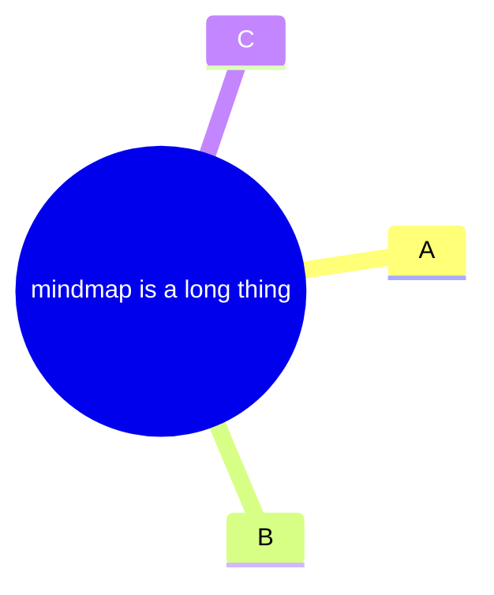

For documentation, apply strict formatting rules to both code samples and embedded assets:

- Use the correct fenced-code language for rendered examples: fence Mermaid diagram samples with `mermaid-example` and keep indentation consistent.
- For diagram YAML frontmatter, follow the exact delimiter and YAML rules:
  - Use `---` on its own line (the first line must contain only `---`).
  - Keep YAML indentation consistent.
  - Treat keys/settings as case-sensitive; invalid YAML/parameters may break rendering.
  - Follow YAML syntax requirements for strings (quotes may be needed depending on content).

Example:
```markdown
---
config:
  layout: tidy-tree
---


```

- Image accessibility: keep `alt` text short and descriptive (avoid long sentences for banners/thumbnails).