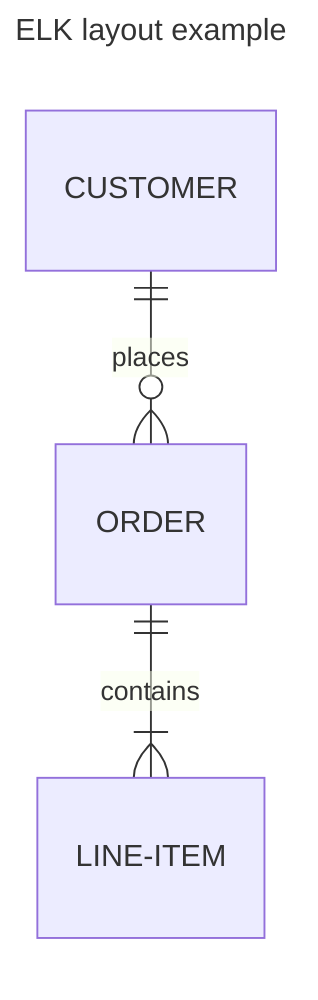

All documentation examples/configs must be compatible with the docs build/render pipeline and current Mermaid configuration conventions.

**Apply this checklist when touching documentation:**
- **Use the current config mechanism**: prefer YAML/frontmatter (and `themeVariables`) over deprecated `%%{init: ...}%%` in examples.
- **Version-gate features** in docs using `(v<MERMAID_RELEASE_VERSION>+)` (or the project’s equivalent placeholder) when the behavior is version-dependent.
- **Never duplicate render blocks**: if the docs tooling auto-renders `mermaid-example`, include **one** block—don’t add multiple identical code fences.
- **Keep code fences and syntax valid for the renderer** (no extra punctuation/backticks that would prevent rendering).
- **Prefer Mermaid-supported formatting** for diagram text (avoid relying on Markdown-only behavior when Mermaid parsing expects different line-break semantics).
- **Use relative internal links** in source docs (so site link rewriting works).

**Example (correct: frontmatter + single mermaid-example + version tag):**
```md

```

**Example (avoid):**
- Using `%%{init: ...}%%` when examples have been migrated to YAML/frontmatter.
- Copy-pasting the same `mermaid-example` block twice (final docs will render duplicates).